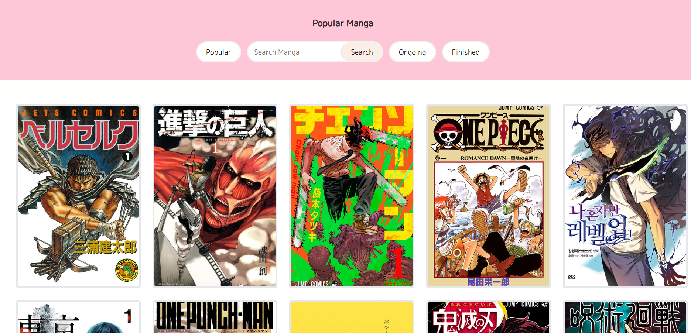
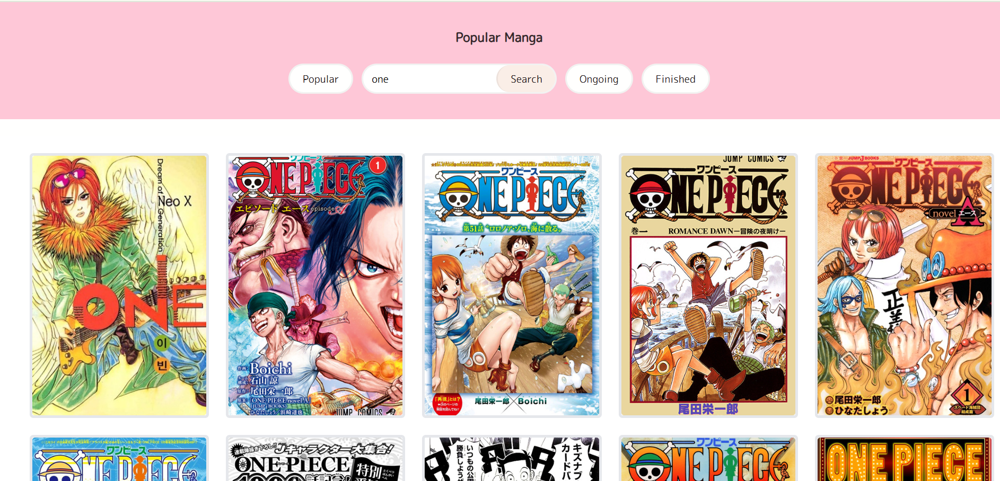
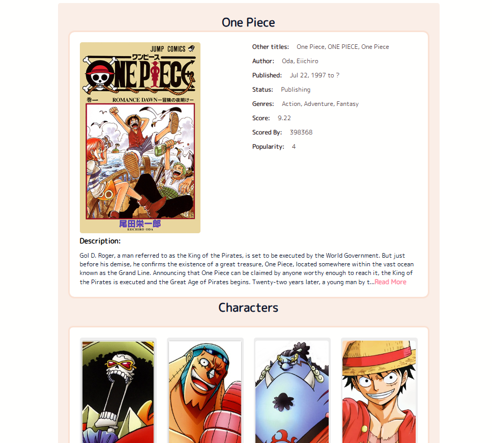
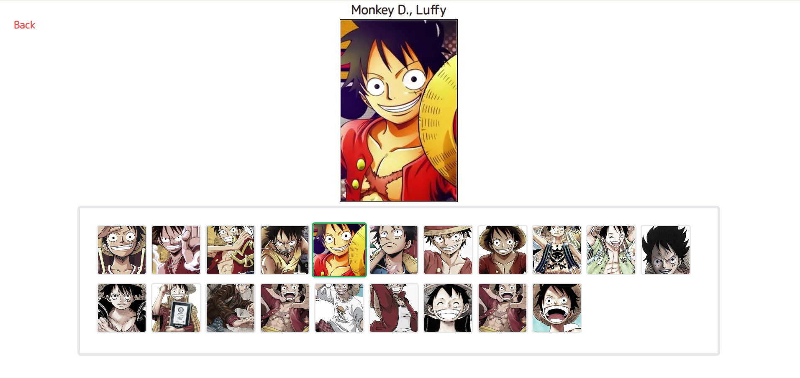

# Manga Info Website - A Comprehensive Manga Database

This comprehensive project allows users to explore their favorite manga titles, discover new series, and dive into detailed information including genres, chapters, publication status. With data fetched from a robust external API, this site presents an extensive collection of manga, making it a go-to resource for manga enthusiasts.

Built with modern web technologies, the Manga Info Website offers a seamless, engaging user experience that makes exploring manga an immersive and enjoyable activity. Whether you're new to manga or a long-time fan, this project provides a rich, interactive database to enhance your manga discovery.
Currently, two official plugins are available:

## Screenshots
1. __Start page__
   
2. __Searching__ 

3. __Manga information page__ 

4. __Characters gallery__ 

=======

## Key Features
    * __Search Functionality__: Quickly search for manga titles, genres, and authors.
    * __In-Depth Manga Informatio__n: View detailed information about any manga, including the description, genre, number of chapters, status (Ongoing/Completed).
    * __Responsive and Mobile-Friendly Design__: Ensures the site is usable and visually appealing across all devices.
    * __API Integration__: Utilizes an external manga API to fetch up-to-date data.
    * __Rich Database__: Covers a vast collection of manga from different genres and time periods, providing an extensive resource for manga fans.

## Usage
Upon running the app, users can search for their favorite manga by title. The site will then display relevant manga entries with the following detailed information:

Manga Title
Manga Description
Genre(s)
Release Date
Number of Chapters
Status (Ongoing/Completed)
Author Information
Characters Information

=======
# manga_info_database
The Manga Info Website is a large-scale, dynamic web application designed to provide detailed, real-time information about a vast range of manga series. 
>>>>>>> d0e5890ab157bf4b61d15efea230dff961165de1
